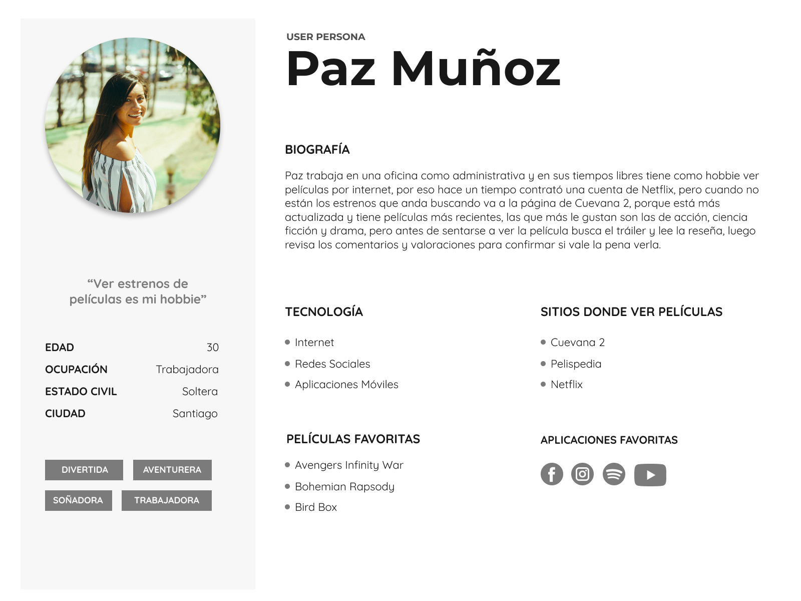
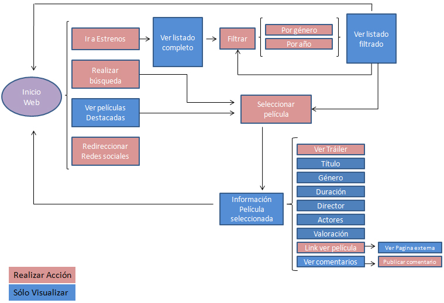
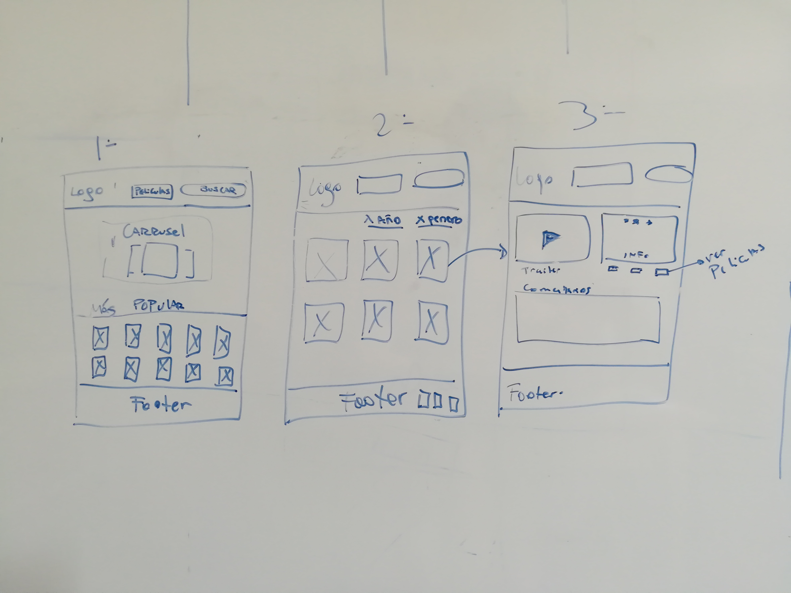
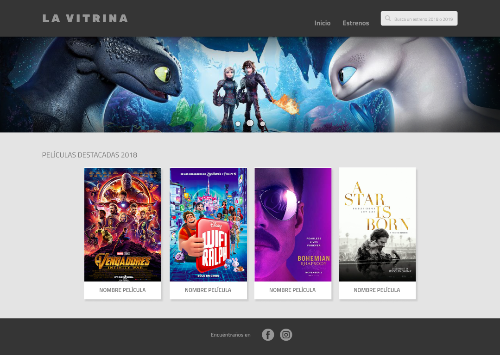
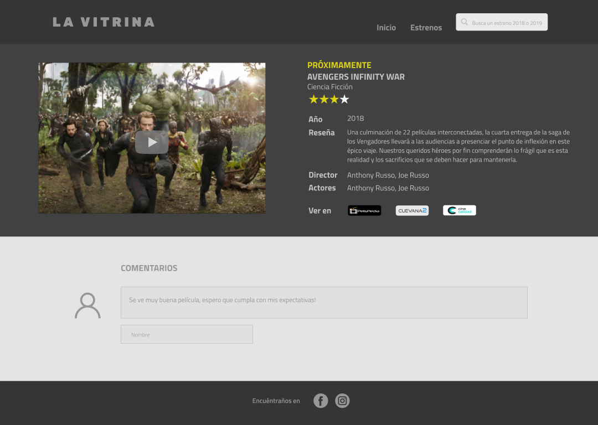
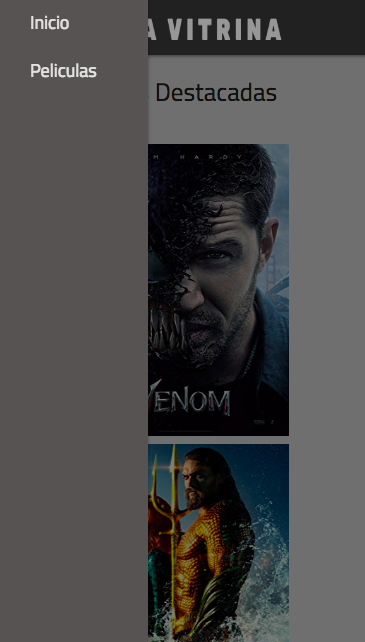

    

Una página web que exhibe los estrenos de películas más actuales (2018-2019), donde podrán encontrar información, trailers y verlas sin necesidad de buscar en diferentes sitios, porque en **LA VITRINA** enviamos directamente a nuestros usuarios a las páginas de películas online más visitadas y destacadas por ellos.

## Investigación
### Encuesta
Realizamos una encuesta mediante formulario de Google y luego la compartimos de manera pública.

Puedes ver las preguntas y respuestas en nuestro documento de Google Drive, haciendo [click aquí](https://docs.google.com/forms/d/1Oy71WMMF2-9QcwDL922c0qzEWTUbKvU89VMZmH5egVQ/edit?usp=sharing).

### Conclusión Resultados Encuesta
**Total personas encuestadas: 22**

Los usuarios son mujeres y hombres entre 19 y 55 años, quienes dedican parte de su tiempo libre a ver películas, prefiriendo la mayoría los estrenos del género acción y ciencia ficción. Dentro de sus páginas favoritas para verlas por internet se encuentra Cuevana2, Netflix y Cine Calidad, los motivos son porque no hay demasiada publicidad, por la resolución y porque encuentran las más actuales, como Bohemian Rapsody, Bird Box y Avengers Infinity War, pero antes de decidir hacer click en play se basan en los comentarios de las personas, las valoraciones, actores y reseña.

Estos resultados obtenidos son llevan a definir nuestro **User Persona**:

    

## Historias de Usuario + Definition of Done

_"Como usuario quiero ver los estrenos de películas entre 2018 y 2019 para saber cuáles no he visto."_

| Definition of Done
|--------------------------|
|Mostrar estrenos entre 2018 y 2019.|
|Permitir seleccionar año de estreno (entre 2018 y 2019).|

_"Como usuario quiero saber las películas que se estrenarán en 2019 para estar actualizado."_

| Definition of Done
|--------------------------|
| Mostrar películas que se estrenará en 2019.|

_"Como usuario necesito saber los comentarios de la película de mi interés que seleccioné, para decidir si la veo o no."_

| Definition of Done
|--------------------------|
| Mostrar portada de película y nombre.|
| Mostrar comentarios de la película seleccionada.|

_"Como usuario necesito saber de qué se trata la película para confirmar si es de mi interés."_

| Definition of Done
|--------------------------|
| Mostrar reseña de la película.|

_"Como usuario quiero saber en qué páginas puedo encontrar la película que quiero ver para que mi búsqueda sea más rápida."_

| Definition of Done
|--------------------------|
| Mostrar link de páginas donde puede ver la película. |

_"Como usuario necesito buscar una película específica para encontrar su información rápidamente."_

| Definition of Done
|--------------------------|
| Mostrar barra de buscador.|
| Permitir ingresar nombre de película. |
| Mostrar botón “OK” para realizar la búsqueda.|
| Mostrar información sobre la película.|

_"Como usuario quiero buscar una película de acción para ver cuál podría llamar mi atención."_

| Definition of Done
|--------------------------|
| Mostrar sección “Género”.|
| Permitir escoger el género de película.|
| Mostrar película por género.|

_"Como usuario quiero saber la valoración que tiene la película que es de mi interés para decidir si la veo o no."_

| Definition of Done
|--------------------------|
| Mostrar valoración o puntuación de la película. |

_"Como usuario y fanático de las películas, quiero saber más información como: director, actores para confirmar si será de mi interés."_

| Definition of Done
|--------------------------|
| Mostrar información específica: director y actores. |

_"Como usuario quiero ver el tráiler de la película que me interesa para ver si me llama la atención y decidir si la veo o no."_

| Definition of Done
|--------------------------|
| Mostrar trailer de la película.|

## DISEÑO  INTERFAZ DE USUARIO

### Diagrama de Flujo

En consideración a las historias de usuario, realizamos el siguiente diagrama de flujo para nustra página web a desarrollar:

    

### Prototipo  Baja Fidelidad
Se determina la siguiente información para la interfaz:

| Primera Pantalla
|--------------------------|
| Logotipo |
| Menú |
| Buscador |
| Portadas películas 2019 |
| Portadas películas más destacadas 2018 + nombre|
| Íconos redes sociales |

| Segunda Pantalla
|--------------------------|
| Logotipo |
| Menú |
| Buscador |
| Escoger género |
| Escoger año |
| Estrenos 2018 o 2019 + nombre |
| Íconos redes sociales |

| Tercera Pantalla
|--------------------------|
| Logotipo |
| Menú |
| Buscador |
| Trailer |
| Información Película |
| Comentarios |
| Íconos redes sociales |

    

### Prototipo Alta Fidelidad
Realizamos la interfaz de usuario en la aplicación Figma, puedes verla e interactuar con ella haciendo [click aquí](https://www.figma.com/file/DyDzG7IAW1ecHpyaJzyktIGD/Prototipos-La-Vitrina?node-id=23%3A0)

#### Versión Desktop

    

    

    

    

    

    

#### Versión Mobile

    

    

### Fundamentos Prototipo

- Diseñamos una interfaz minimalista, limpia, con colores representativos del cine, respetando los aires (espacios en blanco), ya que al utilizar diferentes imagenes generan mucha información. 

- Empleamos tipografías sans serif, modernas y sugeridas para páginas web. 

- Creamos un recorrido visual con diferentes tamaños en cuanto a tipografía e imagen, además utilizamos fondos claros y oscuros para generar un contraste con las portadas y trailer de las películas.

## SOBRE EL SITIO WEB

### ¿Por qué La Vitrina?
El nombre se crea en relación al concepto utilizado en marketing, somos una página exhibidora de los últimos estrenos de películas, donde tienes que clickear en la que más te interese y podrás saber de ella en más profundidad y sólo si entras a la carátula podrás verla en una selección de las mejores páginas web de películas online, sin necesidad de googlear en demasiados sitios. 

¡Te invitamos a **vitrinear** estrenos en nuestra página web!
Link página

Es gratuita y no necesitas registrarte.

### ¿Cómo se usa?
- Debes abrir el navegador y escribir el sitio www.lavitrina.cl.

- Para buscar un estreno de 2018 o 2019 puedes ir a la barra de menú y hacer click en **Estrenos**, luego seleccionar el **Año** que te interesa, hacer click en la carátula de la película y podrás ver información, trailer y las páginas donde se encuentra disponible ver online.

- Para buscar un estreno en particular sólo debes **ingresar el nombre en la barra de buscador** que se encuentra en la parte superior derecha de la página, apretar **enter** en tu teclado y podrás ver información sobre la película, trailer y las páginas donde se encuentra disponible ver online.

- ¿Te interesan los 4 estrenos más populares?, los puedes ver en la página de inicio y hacer click en la carátula para obtener más información.

- ¿Quieres dejar un **comentario** sobre una película en particular?, sólo debes buscarla, hacer click en la carátula y aparecerá la información + una **sección para ingresar tu opinión** sobre ese estreno.

### Funcionalidad
Para el desarrollo de esta página se utilizó lenguaje JavaScript (ES6), Vanilla Javascript, HTML5 y CSS, framework Materialize (no se hizo uso de jquery).

### Resultados Testeo Usabilidad
Las personas testeadas comprenden que se trata de una página para ver películas o información de ellas, por el nombre "La Vitrina" la relacionan a un sitio donde se muestran trailers o reseñas, además concuerdan en que les parece buena idea que sólo muestre los últimos estrenos, porque de esta manera hace su búsqueda más rápida para ver lo más actual.

Las tareas designadas fueron realizadas, no se observaron problemas o complicaciones para el usuario.

Y dentro de las sugerencias que recibimos de las personas testeadas, indicaron que les interesaría ver un ranking de los mejores 10 estrenos, por lo tanto esto se aplicará en las próximas versiones de nuestro sitio.

## ¿Quiénes están detrás de este proyecto?

### Equipo de Producción
A continuación mencionaremos las responsabilidades que tuvo cada una para desarrollar esta página web:

| Encuestas
|--------------------------|
| Equipo |

| Análisis Usuario
|--------------------------|
| Natalie Veloso |

| Historias de Usuario
|--------------------------|
| Natalie Veloso |

| Diagrama de Flujo
|--------------------------|
| Andrea Carreño |
| Natalie Veloso |

| Diseño Interfaz + Prototipos
|--------------------------|
| Andrea Carreño |
| Natalie Veloso |

| Testeos Usuario
|--------------------------|
| Natalie Veloso |

| Estructura HTML y CSS
|--------------------------|
| Johanna Goenaga |

| Manejo DOM
|--------------------------|
| Johanna Goenaga |
| Verioska Ramírez |

| Análisis y Manejo de API
|--------------------------|
| Verioska Ramírez |

| Responsive
|--------------------------|
| Andrea Carreño |
| Johanna Goenaga |

| Readme
|--------------------------|
| Natalie Veloso |

Para ver en más detalle nuestra planificación, puedes [ingresar aquí](https://trello.com/b/hQGheKvr/movies).

